# Screenshots

CameraHub is a complex app, and they say a picture is worth a thousand words. These screenshots illustrate how CameraHub works.

When you first access CameraHub, you'll log in with the superuser password you set during installation.

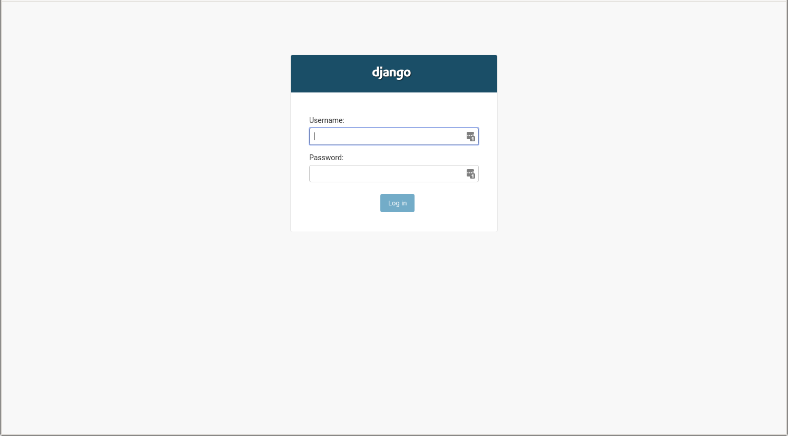

Once logged in, you will see the main menu screen. The most commonly used options have icons and these are what you will use for the majority of your tasks.

You can also use the longer list of options to access everything, if you need to.

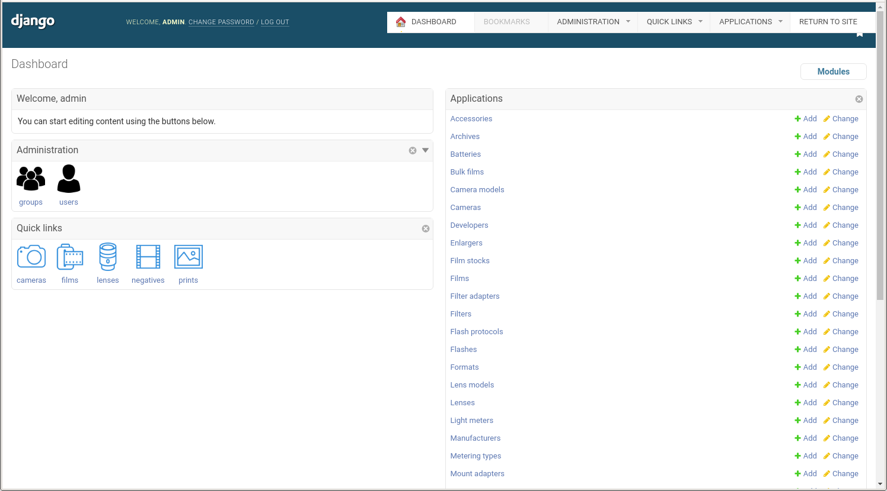

This is what it looks like when you add a new camera model to the database. There's a lot of different fields to enter but this should give you an idea.

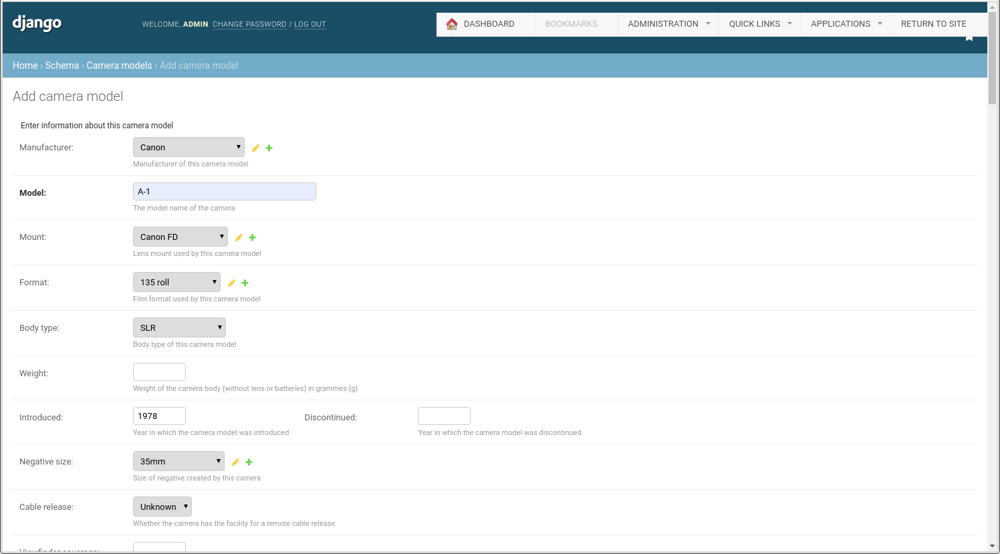

Lower down, this is where you enter which shutter speeds the camera can shoot at.

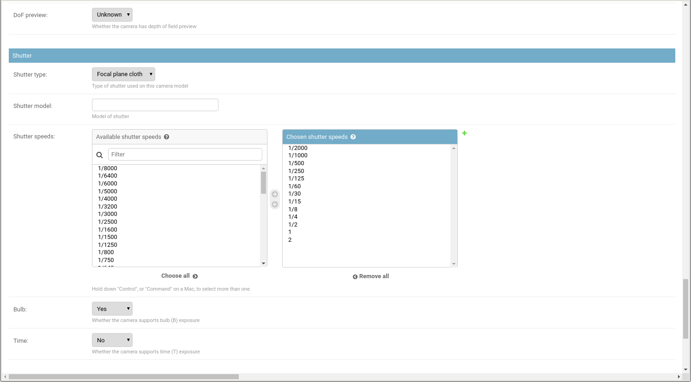

And this is what the camera model list looks like after you've added a camera model.

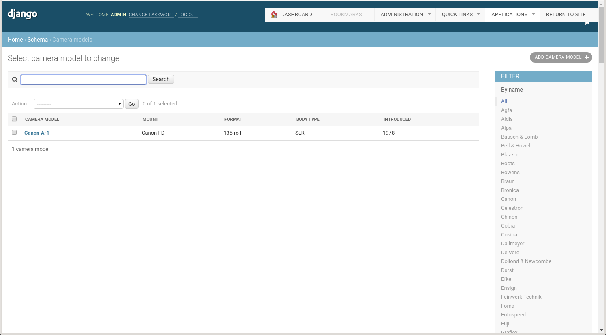

Once you have one or more camera models in the database, you can start adding cameras. You can tell cameras apart from camera models because they are shown with their serial number.

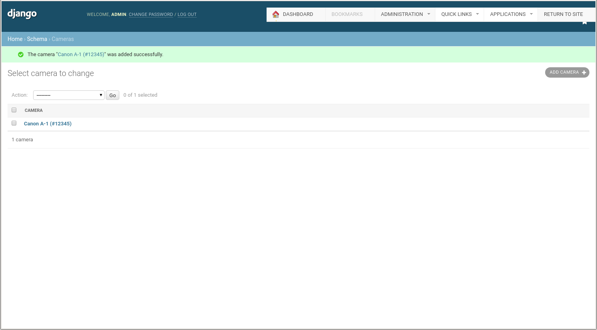

Lenses and lens models work the same way as cameras and camera models. You don't even need to add models separately. When adding a lens you can add the lens model inline if it doesn't already exist.

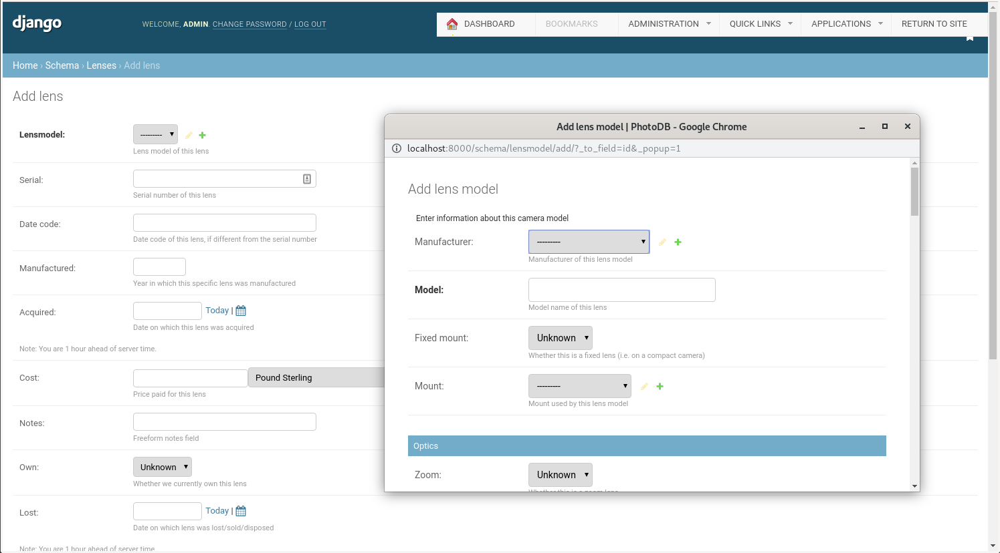

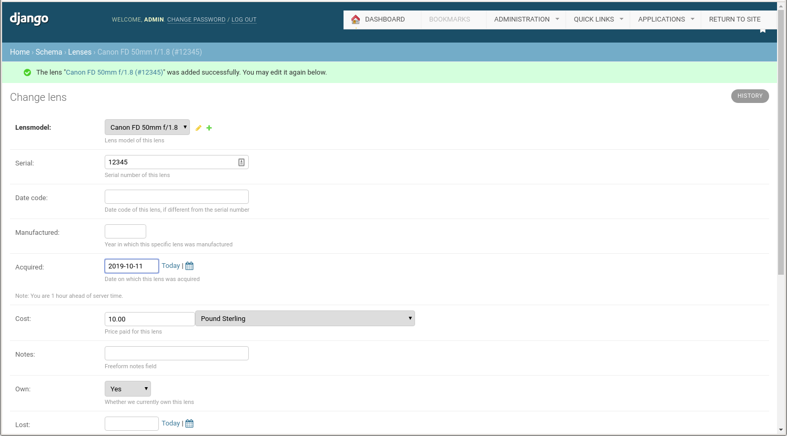

Now all your equipment is registered, we can start registering your photographic media. First you need to create a film.

Once you have a film, you can add negatives to it. You can either do this inline with the film (as pictured) or directly as negatives.

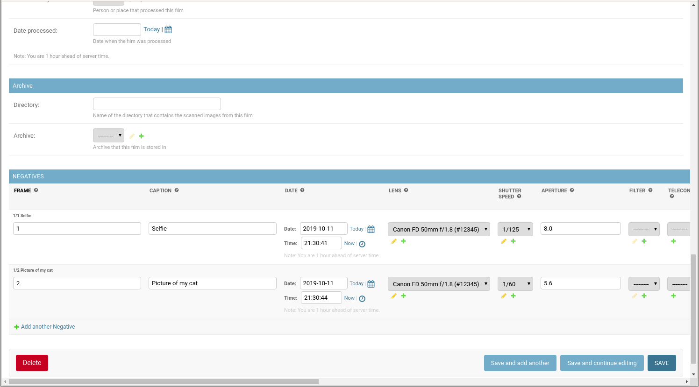

This is what the list of negatives looks like.

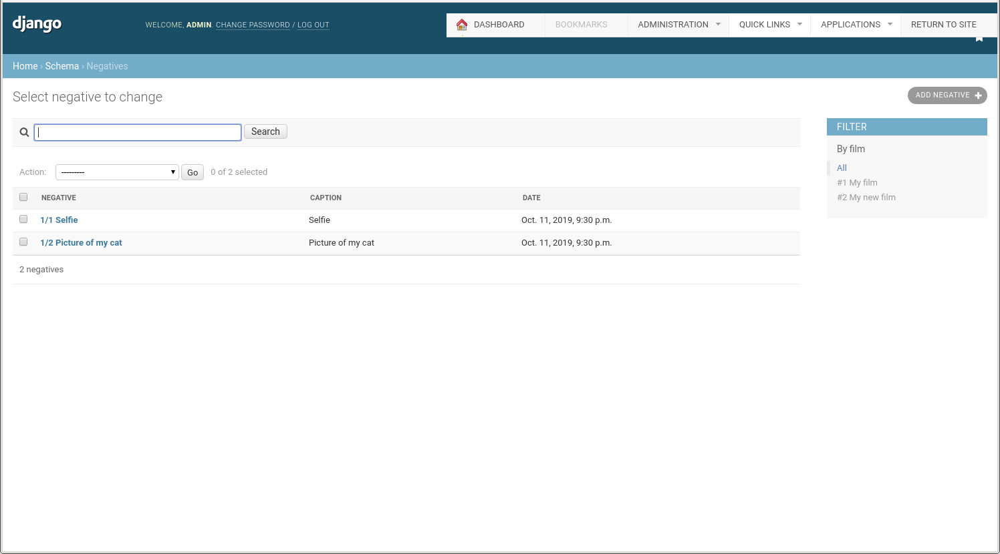

Once you have negatives, you can make prints from them.

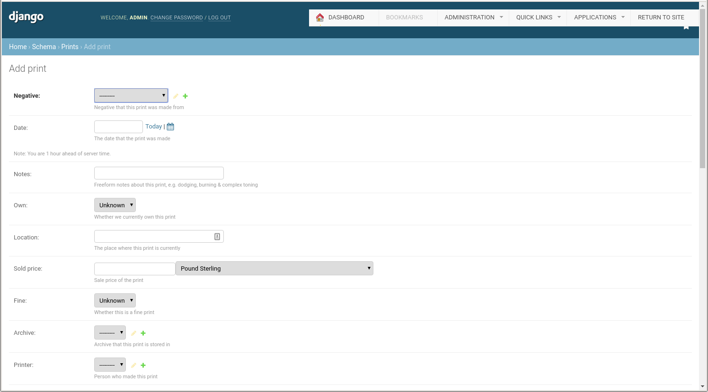
